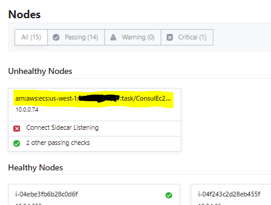

# Consul on Amazon ECS / FARGATE

In this directory:
* CFN template for a simple ECS/Fargate service which joins a [test mesh](../mesh-templates) hosted in Amazon EC2
* `Init` container code (just a script + Dockerfile) which generates the config file and service definition for the Consul node and service

## What it does

On task launch:

1. `config-init` and `counter-service` start first.
2. `config-init` generates Consul config files in a shared volume, then exits.
    * _config.json_ : values to configure the agent
    * _service-counting.json_ : service definition for `counter-service` + its sidecar proxy
3. `consul-agent` starts after `config-init` completes, then:
    * attempts to join the list of agents provided in _config.json_ (will retry)
    * registers `counter-service` with the mesh 

Consul nodes should appear as the names of the tasks they're running on:

## What it does NOT do (yet)
* Auto-join EC2-hosted Consul clusters :C
    * See: https://github.com/hashicorp/go-discover/issues/61
* Start the Consul proxy process to serve traffic to/from the service instance
    * next task to tackle.
* Use [Access Control Lists](https://www.consul.io/docs/security/acl) to authenticate traffic

## Other caveats
* `amazonlinux` base image for `config-init` is very much overkill (slimmer linux image w/ `curl` and `bash` should work too)
