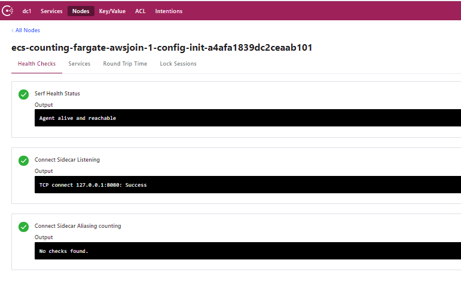

# Consul on Amazon ECS / FARGATE

In this directory:
* CFN template for a simple ECS/Fargate service which joins a [test mesh](../mesh-templates) hosted in Amazon EC2
* `Init` container code (just a script + Dockerfile) which generates the config file and service definition for the Consul node and service

## What it does

On task launch:

1. `config-init` and `counter-service` start first.
2. `config-init` generates Consul config files in a shared volume, then exits.
    * _config.json_ : values to configure the agent
    * _service-counting.json_ : service definition for `counter-service` + its sidecar proxy
3. `consul-agent` starts after `config-init` completes, then:
    * attempts to join the list of agents provided in _config.json_ (will retry)
    * registers `counter-service` with the mesh
4. `consul-proxy` starts after `consul-agent` and registers itself as the sidecar for the _**counting**_ service.

Consul nodes should appear as the "DockerName" of the init container (TODO: use task ID instead):

## What it does NOT do (yet?)
* Meaningfully proxy upstream traffic to/from the service instance - but [_this_ Fargate service](../mesh-templates/fargate-versions/greeter) does!
* Auto-join for EC2-hosted Consul clusters _will_ work, but you need to specify a region.
    * See: https://github.com/hashicorp/go-discover/issues/61

* Use [Access Control Lists](https://www.consul.io/docs/security/acl) to authenticate traffic

## Other caveats
* `amazonlinux` base image for `config-init` is very much overkill. Slimmer linux env with the following should also work:
    * awk, curl, echo, jq
* Not loving that we need 4 containers. But the sidecars are pretty light, so maybe it's not so bad?
